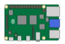

<div align="center">



## **My Raspberry Pi Kubernetes Cluster** (Bramble :deciduous_tree:) <!-- omit in toc -->

### _... created and managed by Flux_ (IaC :large_blue_diamond:) <!-- omit in toc -->

</div>

<br/>

<div align="center">

[](https://k3s.io/)
[](https://github.com/pre-commit/pre-commit)
[](https://github.com/renovatebot/renovate)
[](https://github.com/ground7/bramble-iac/graphs/contributors)

</div>

---

## :book:&nbsp; Overview <!-- omit in toc -->

- [:computer:&nbsp; Hardware](#computer-hardware)
- [:open_file_folder:&nbsp; Repository structure](#open_file_folder-repository-structure)

## :computer:&nbsp; Hardware

&nbsp;|Name|Role|Storage
:-:|:-:|:-:|:-:
|Elderberry|K3s Server Node 1|Flash
|Cranberry|K3s Server Node 2|Flash
|Snowberry|K3s Server Node 3|Flash
|Strawberry|K3s Agent Node 1|Flash & SSD
|Blueberry|K3s Agent Node 2|Flash & SSD
|Blackberry|K3s Agent Node 3|Flash & SSD
|Boysenberry|K3s Agent Node 4|Flash & SSD
|Dingleberry|K3s Agent Node 5|Flash

## :open_file_folder:&nbsp; Repository structure

These are the directories under `cluster` ordered by how Flux will apply them.

- **base** directory is the entrypoint to Flux and contains pointers to all the upstream helm chart repositories
- **crds** directory contains custom resource definitions (CRDs) that need to exist globally in the cluster before anything else exists
- **core** directory (depends on **crds**) is for important infrastructure applications (grouped by namespace) that should never be pruned by Flux
- **apps** directory (depends on **core**) is for common applications (grouped by namespace) that can be pruned by Flux if they are not tracked by Git anymore

```
cluster
├── apps
│   ├── default
│   ├── kube-system
│   ├── monitoring
│   ├── networking
│   └── system-upgrade
├── base
│   └── flux-system
├── core
│   ├── cert-manager
│   ├── longhorn-system
│   ├── metallb-system
│   ├── namespaces
│   └── system-upgrade
└── crds
    ├── cert-manager
    ├── kube-prometheus-stack
    └── traefik
```